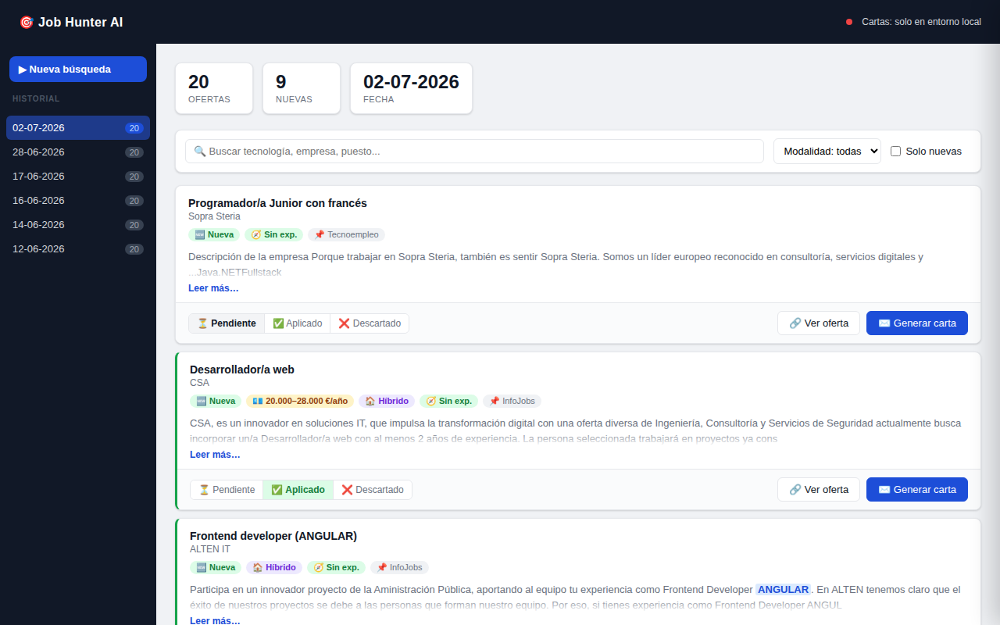

# 🎯 job-hunter-ai

> Automatiza tu búsqueda de empleo: scraping de portales, dashboard con CRM de candidaturas y cartas de presentación generadas con IA.

**🌐 Demo en vivo: [automatico-five.vercel.app](https://automatico-five.vercel.app)**

<p align="center">
  
</p>

[](https://nodejs.org/)
[](https://expressjs.com/)
[](https://cheerio.js.org/)
[](https://ollama.com/)
[](https://groq.com/)
[](https://vercel.com/)

**job-hunter-ai** rastrea ofertas de trabajo en **Tecnoempleo** e **InfoJobs**, las filtra según tu perfil (keywords, ciudad, palabras excluidas), detecta cuáles son nuevas respecto a ejecuciones anteriores y las presenta en un dashboard web donde puedes hacer seguimiento de cada candidatura y generar una carta de presentación personalizada por oferta con un LLM.

Funciona en dos entornos con el mismo código:

- **Local** — CLI + dashboard Express, con IA gratuita vía [Ollama](https://ollama.com)
- **Producción** — desplegado en Vercel como función serverless, con persistencia en Vercel Blob

## ✨ Características

- 🔍 **Scraping multi-portal**: Tecnoempleo (HTML con cheerio) e InfoJobs (API oficial OAuth / JSON embebido), con deduplicación por URL y pausas entre peticiones para no saturar los portales
- 🆕 **Detección de ofertas nuevas**: compara contra `data/seen_jobs.json`; las nuevas siempre aparecen primero y nunca quedan fuera por el tope de ofertas por ejecución
- 🧠 **Filtrado inteligente**: por palabra completa (`java` no descarta `javascript`), ciudad o trabajo 100% remoto, y orden por experiencia requerida (sin experiencia → junior → mid → senior)
- 📋 **CRM de candidaturas**: marca cada oferta como pendiente, aplicada, entrevista, descartada… con filtros en tiempo real en el dashboard
- ✉️ **Cartas de presentación con IA**: generadas bajo demanda por oferta, con streaming token a token (SSE) y persistencia en disco — si ya existe, se muestra al instante
- 🤖 **Doble proveedor de LLM con la misma interfaz**: Ollama en local (gratis, sin API key) y Groq en producción
- 📊 **Dashboard web**: historial de ejecuciones por fecha, botón "Nueva búsqueda" con logs en directo, SPA en vanilla JS sin build step
- 🔐 **Listo para exponer en público**: token de administración para las acciones de escritura, protección anti fuerza bruta y validación estricta de entradas
- 📧 **Resumen por email** (opcional, con nodemailer)

## 🏗️ Cómo funciona

```
┌─────────────┐     ┌──────────────┐     ┌─────────────────────┐
│  Scrapers    │ ──▶ │  Filtrado +  │ ──▶ │  output/YYYY-MM-DD/  │
│  Tecnoempleo │     │  detección   │     │  resumen.md / .json  │
│  InfoJobs    │     │  de nuevas   │     │  (o Vercel Blob)     │
└─────────────┘     └──────────────┘     └──────────┬──────────┘
                                                     │
                          ┌──────────────────────────▼──────────┐
                          │   Dashboard Express (puerto 3000)    │
                          │   historial · CRM · cartas con IA    │
                          └──────────────┬───────────────────────┘
                                         │ bajo demanda
                                  ┌──────▼───────┐
                                  │ Ollama (local)│
                                  │ Groq (cloud)  │
                                  └──────────────┘
```

La IA **no puntúa ofertas en bloque**: las cartas se generan solo cuando las pides desde el dashboard, así el flujo de scraping es rápido y no depende de ningún LLM.

## 🚀 Empezar

### Requisitos

- Node.js 18+
- [Ollama](https://ollama.com) con un modelo instalado (`ollama pull llama3`) — solo si quieres generar cartas en local

### Instalación

```bash
git clone <repo-url>
cd automatico
npm install
cp .env.example .env   # rellena tus credenciales
```

### Uso

```bash
npm start          # scraping CLI — genera el resumen del día, sin IA
npm run serve      # dashboard web en http://localhost:3000
npm run dev        # scraping con nodemon (desarrollo)
npm run serve:dev  # dashboard con nodemon (desarrollo)
```

Cada ejecución genera `output/YYYY-MM-DD/` con:

| Archivo | Contenido |
|---|---|
| `resumen.md` | Resumen legible de las ofertas del día |
| `resumen.json` | Datos estructurados que consume el dashboard |
| `{slug}_carta.md` | Cartas generadas bajo demanda desde el dashboard |

## ⚙️ Configuración

Variables en `.env` (ver `.env.example`):

| Variable | Descripción |
|---|---|
| `OLLAMA_MODEL` | Modelo de Ollama en local (por defecto `llama3`) |
| `OLLAMA_BASE_URL` | URL de Ollama (por defecto `http://localhost:11434`) |
| `GROQ_API_KEY` | Si existe, se usa Groq en lugar de Ollama (producción) |
| `GROQ_MODEL` | Modelo de Groq (por defecto `llama-3.1-8b-instant`) |
| `INFOJOBS_CLIENT_ID` / `INFOJOBS_CLIENT_SECRET` | Credenciales de la [API oficial de InfoJobs](https://developer.infojobs.net/) |
| `MAX_OFFERS_PER_RUN` | Tope de ofertas en el resumen (las nuevas nunca quedan fuera) |
| `ADMIN_TOKEN` | Token para las acciones de escritura del dashboard en producción |
| `BLOB_READ_WRITE_TOKEN` | Persistencia en Vercel Blob (solo producción) |
| `EMAIL_*` | SMTP para el envío opcional del resumen por email |

Tu perfil profesional (stack, keywords de búsqueda, palabras excluidas, ciudad) se configura en [`src/config/profile.js`](src/config/profile.js) — es lo que alimenta tanto los filtros del scraping como los prompts de las cartas.

## ☁️ Despliegue en Vercel

La app Express completa corre como una única función serverless ([`api/index.js`](api/index.js)). En producción:

- La persistencia pasa de disco a **Vercel Blob** (escrituras versionadas para consistencia inmediata)
- El LLM pasa de Ollama a **Groq** automáticamente si existe `GROQ_API_KEY`
- Las acciones de escritura (lanzar búsquedas, generar cartas, cambiar estados) requieren `ADMIN_TOKEN`

```bash
vercel deploy --prod
```

## 📁 Estructura

```
├── src/
│   ├── scraper/        # tecnoempleo.js, infojobs.js, infojobsApi.js
│   ├── ai/             # llm.js (adaptador Ollama/Groq), letterWriter.js, prompts.js
│   ├── utils/          # storage, output (md+json), mailer
│   ├── config/         # profile.js — tu perfil y criterios de búsqueda
│   ├── index.js        # entry point del CLI
│   └── server.js       # dashboard Express
├── public/             # SPA vanilla JS (sin framework, sin build)
├── api/index.js        # entry point serverless para Vercel
├── data/seen_jobs.json # URLs ya vistas
└── output/YYYY-MM-DD/  # resúmenes y cartas por fecha
```

## 🛠️ Stack

Node.js (CommonJS) · Express · axios + cheerio · Ollama / Groq (Llama 3) · Vercel Blob · nodemailer · vanilla JS en el front

## 📄 Licencia

[MIT](LICENSE)

---

Hecho por [Mario Minuesa](mailto:mario@minuesa.es) 
