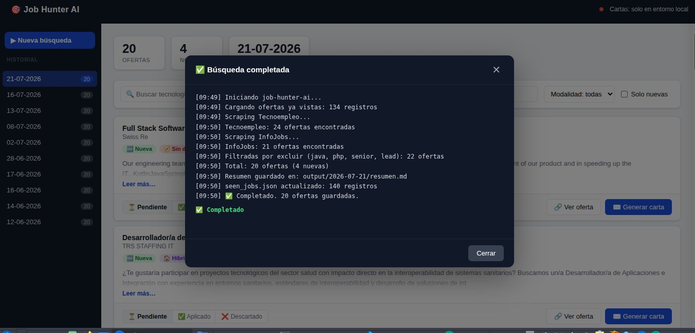

# job-hunter-ai

> Automatiza la búsqueda de empleo: scraping multi-portal, dashboard con CRM de candidaturas y cartas de presentación generadas con IA en tiempo real.

<p align="center">
  <a href="https://automatico-five.vercel.app"><strong>🌐 Demo en vivo → automatico-five.vercel.app</strong></a>
</p>

<p align="center">
  
</p>

<p align="center">
  
  
  
  
  
  
  
</p>

---

## Por qué lo construí

Buscando trabajo como desarrollador noté que pasaba más tiempo filtrando portales que preparando candidaturas. Lo automaticé: un script que raspa Tecnoempleo e InfoJobs, filtra por mi stack exacto, detecta solo las ofertas nuevas y me da un dashboard donde gestionar el estado de cada aplicación y generar una carta personalizada con IA, directamente en el navegador.

El reto técnico interesante fue hacer que el mismo código funcionase en local (Ollama, `fs`) y en producción serverless (Groq, Vercel Blob) sin duplicar lógica.

---

## Qué hace

- **Scraping multi-portal**: Tecnoempleo (HTML + Cheerio) e InfoJobs (API oficial OAuth 2.0 / JSON embebido como fallback), con pausas entre peticiones y deduplicación por URL.
- **Detección de novedades**: compara contra `seen_jobs.json`; las nuevas siempre aparecen primero y nunca quedan fuera por el tope de resultados.
- **Filtrado inteligente**: por palabra completa (`java` no descarta `javascript`), ciudad, modalidad y nivel de experiencia — ordena de menor a mayor seniority.
- **Dashboard web**: historial de ejecuciones por fecha, búsqueda con logs en directo vía SSE, CRM con filtros en tiempo real. SPA vanilla JS, sin framework, sin build step.
- **Cartas con IA en streaming**: tokens en tiempo real (SSE). Si ya existe, se sirve al instante desde caché.
- **Doble proveedor de LLM**: Ollama en local (gratis, sin API key) y Groq en producción, intercambiables sin cambiar el código de negocio.
- **Resumen por email** (opcional, nodemailer/SMTP).

---

## Arquitectura

```
┌──────────────────────────────────────────────────────┐
│  Scrapers                                            │
│  tecnoempleo.js  →  Cheerio (HTML)                   │
│  infojobsApi.js  →  OAuth 2.0 / JSON embebido        │
└──────────────────────┬───────────────────────────────┘
                       │ ofertas crudas
┌──────────────────────▼───────────────────────────────┐
│  Pipeline de filtrado                                │
│  · palabra completa  · ciudad  · duplicados          │
│  · detección de nuevas (seen_jobs.json)              │
│  · orden por seniority                               │
└──────────────────────┬───────────────────────────────┘
                       │ resumen.json + resumen.md
         ┌─────────────▼──────────────────┐
         │  Storage adapter               │
         │  local → fs   |  prod → Blob   │
         └─────────────┬──────────────────┘
                       │
┌──────────────────────▼───────────────────────────────┐
│  Express / Vercel Serverless Function                │
│  REST API  +  SSE (búsqueda en directo, streaming)   │
│  Auth: timing-safe token  +  rate-limit por IP       │
└──────────────────────┬───────────────────────────────┘
                       │ bajo demanda
              ┌────────▼────────┐
              │   LLM adapter   │
              │ Ollama (local)  │
              │ Groq   (cloud)  │
              └─────────────────┘
```

---

## Decisiones técnicas relevantes

### Adaptador de LLM: mismo contrato, dos proveedores

`src/ai/llm.js` expone `generar()` y `generarStream()`. Internamente detecta el entorno: si existe `GROQ_API_KEY` parsea el stream SSE estilo OpenAI (`data: {...}` / `data: [DONE]`); si no, parsea el NDJSON de Ollama (`{ response, done }`). Ambos corren modelos Llama, así el mismo prompt funciona igual en los dos entornos. El servidor nunca sabe qué proveedor hay debajo.

### Streaming real con AbortController

Las cartas se generan con SSE: el cliente ve tokens en tiempo real. Si el usuario cierra la conexión (botón "Detener"), `req.on('close')` aborta la petición HTTP al LLM antes de que termine, liberando recursos sin esperar:

```js
const controller = new AbortController();
req.on('close', () => controller.abort());
await llm.generarStream(prompt, (token) => send({ token }), controller.signal);
```

### Comparación de tokens en tiempo constante

Para evitar que un atacante mida tiempos de respuesta y deduzca caracteres del token de administración:

```js
function tokenCorrecto(enviado, token) {
  const a = Buffer.from(String(enviado || ''));
  const b = Buffer.from(token);
  return a.length === b.length && crypto.timingSafeEqual(a, b);
}
```

### Anti-fuerza-bruta por IP en memoria

Tras 5 intentos fallidos en 15 minutos la IP recibe 429. El contador se limpia en el primer acierto. El mapa tiene tope de 1000 IPs para evitar OOM en serverless.

### Capa de persistencia intercambiable

`src/utils/store.js` abstrae `fs` (local) y `@vercel/blob` (producción) con la misma API: `leerJSON`, `escribirJSON`, `leerTexto`, `escribirTexto`, `listar`. El servidor no sabe en qué entorno corre.

### Filtrado de palabras completas

`java` aparece en `javascript`, `javaspring`, `javafx`… El filtro usa `\b` para excluir solo si es palabra completa:

```js
const regex = new RegExp(`\\b${keyword}\\b`, 'i');
```

---

## Stack

| Capa | Tecnología |
|---|---|
| Runtime | Node.js 18+ (CommonJS) |
| Framework | Express 5 |
| Scraping | axios + Cheerio |
| IA | Ollama (local) / Groq API (cloud) — Llama 3 |
| Persistencia | fs (local) / Vercel Blob (prod) |
| Frontend | Vanilla JS + CSS — sin framework, sin build step |
| Deploy | Vercel (función serverless única) |
| Tests | Playwright (smoke test + screenshot) |

---

## Empezar en local

**Requisitos**: Node.js 18+ y [Ollama](https://ollama.com) con un modelo instalado (`ollama pull llama3`) si quieres generar cartas en local.

```bash
git clone https://github.com/Mariomin23/automatico.git
cd automatico
npm install
cp .env.example .env   # rellena tus credenciales
```

```bash
npm start          # scraping CLI — genera el resumen del día
npm run serve      # dashboard en http://localhost:3000
npm run dev        # scraping con hot-reload
npm run serve:dev  # dashboard con hot-reload
```

Cada ejecución crea `output/YYYY-MM-DD/`:

| Archivo | Contenido |
|---|---|
| `resumen.md` | Resumen legible |
| `resumen.json` | Datos que consume el dashboard |
| `{slug}_carta.md` | Cartas generadas bajo demanda |

---

## Configuración

Variables en `.env` (ver `.env.example`):

| Variable | Descripción |
|---|---|
| `OLLAMA_MODEL` | Modelo Ollama en local (default: `llama3`) |
| `OLLAMA_BASE_URL` | URL de Ollama (default: `http://localhost:11434`) |
| `GROQ_API_KEY` | Si existe, activa Groq en lugar de Ollama |
| `GROQ_MODEL` | Modelo Groq (default: `llama-3.1-8b-instant`) |
| `INFOJOBS_CLIENT_ID / SECRET` | [API oficial InfoJobs](https://developer.infojobs.net/) |
| `MAX_OFFERS_PER_RUN` | Tope de ofertas (las nuevas nunca quedan fuera) |
| `ADMIN_TOKEN` | Protege endpoints de escritura en producción |
| `BLOB_READ_WRITE_TOKEN` | Vercel Blob (solo producción) |
| `EMAIL_*` | SMTP para envío opcional por email |

Tu perfil (stack, keywords, ciudad, palabras excluidas) va en [`src/config/profile.js`](src/config/profile.js) — alimenta tanto los filtros de scraping como los prompts de las cartas.

---

## Despliegue en Vercel

La app Express completa corre como una única función serverless ([`api/index.js`](api/index.js)). En producción el código detecta el entorno y activa Vercel Blob y Groq automáticamente.

```bash
vercel deploy --prod
```

---

## Estructura

```
├── src/
│   ├── scraper/        # tecnoempleo.js · infojobs.js · infojobsApi.js
│   ├── ai/             # llm.js (adaptador) · letterWriter.js · prompts.js · scorer.js
│   ├── utils/          # store.js · storage.js · output.js · mailer.js
│   ├── config/         # profile.js — perfil y criterios de búsqueda
│   ├── index.js        # entry point CLI
│   └── server.js       # dashboard Express + API REST
├── public/             # SPA vanilla JS (sin framework, sin build)
├── api/index.js        # entry point serverless para Vercel
├── data/
│   ├── seen_jobs.json            # URLs ya procesadas
│   └── applications_status.json  # CRM — estado por slug
└── output/YYYY-MM-DD/            # resúmenes y cartas por fecha
```

---

## Licencia

[MIT](LICENSE) · Mario Minuesa · [mario.minuesa@gmail.com](mailto:mario.minuesa@gmail.com)
